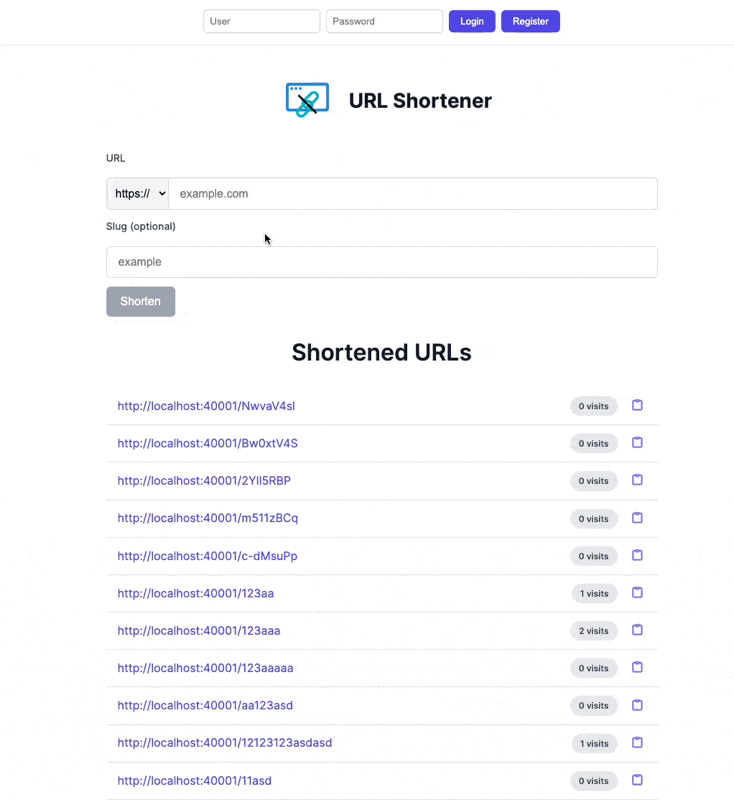
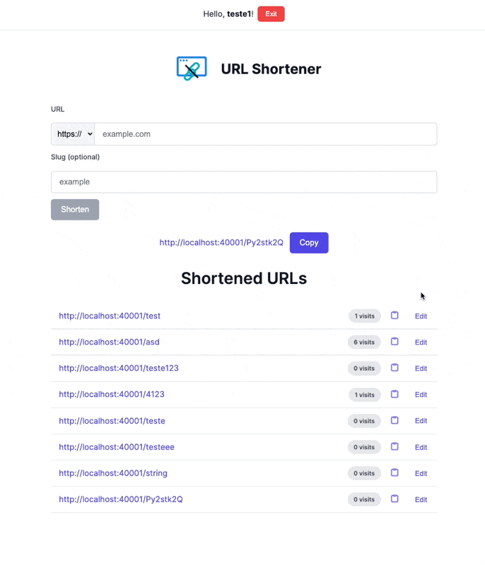

# Deep Origin - URL Shortener Test

A complete URL shortening service built with NestJS (backend) and Next.js (frontend).

## Features

### **Core Requirements**
✅ **Shorten URLs**: Supports shortening long URLs into shorter, unique slugs.  
✅ **Redirect to Original URL**: Accessing the shortened URL redirects to the original URL.  
✅ **404 Handling**: Invalid slugs display a custom 404 page.  
✅ **Persist URL Records**: Stores shortened URLs in a PostgreSQL database using Prisma ORM.  
✅ **List All URLs**: Displays a list of all shortened URLs with visit counts.  
✅ **React & TypeScript**: Frontend built with React and TypeScript.  
✅ **Node.js & TypeScript**: Backend built with NestJS and TypeScript.  

---

### **Extra Credit**
✅ **User Authentication**: Supports user accounts with JWT authentication.  
✅ **URL Validation**: Validates URLs entered in the form and displays error messages for invalid inputs.  
✅ **Copy to Clipboard**: One-click copy of shortened URLs to the clipboard.  
✅ **Customizable Slugs**: Allows users to modify the slug of their URLs.  
✅ **Visit Tracking**: Tracks visits to each shortened URL.  
✅ **Rate Limiting**: Implements rate limiting to prevent abuse.  
✅ **Visit Counter**: Displays popularity stats for URLs (visit counts).  
✅ **Docker Support**: Containerized setup with Docker Compose for easy development and deployment.  

## Tech Stack

### **Frontend**
- **Framework**: Next.js  
- **Language**: TypeScript  
- **Styling**: CSS Modules  
- **HTTP Client**: Axios  

### **Backend**
- **Framework**: NestJS  
- **Language**: TypeScript  
- **Database**: PostgreSQL  
- **ORM**: Prisma  
- **Authentication**: JWT  
- **Rate Limiting**: NestJS Throttler  

### **Infrastructure**
- **Containerization**: Docker & Docker Compose  

## Project Structure

- `/backend`: NestJS API for URL shortening with:
  - JWT authentication
  - URL management endpoints
  - Visit statistics
  - Swagger API Documentation
- `/frontend`: Next.js application featuring:
  - URL shortening interface
  - User authentication
  - Visit statistics

## Requirements

- Node.js >=18
- Docker and Docker Compose installed

## Backend Setup

1. Copy `.env.example` to `.env` and configure:
   ```env
    DATABASE_URL=postgresql://postgres:postgres@db:5432/url_shortener
    BASE_URL=http://localhost:40001  
    PORT=40001
    JWT_SECRET=secret-here
    FRONTEND_URL_NOT_FOUND="http://localhost:30001/404"
   ```
2. Install dependencies and start the server:
   ```bash
   cd backend
   npm install
   npx prisma migrate dev --name init
   npm run dev
   ```

## Frontend Setup

1. Copy `.env.local.example` to `.env.local` and set:
   ```env
    NEXT_PUBLIC_API_URL=http://localhost:40001
    API_URL=http://localhost:40001
   ```
2. Start the development server:
   ```bash
   cd frontend
   npm install
   npm run dev
   ```

## Running with Docker

### Using Makefile (from project root)
The Makefile provides shortcuts for common commands:

- Start entire stack (frontend + backend + database):
  ```bash
  make up
  ```
- Stop all services:
  ```bash 
  make down
  ```
- View logs:
  ```bash
  make logs
  ```
- Run backend tests:
  ```bash
  make test-backend
  ```
- Open frontend in browser:
  ```bash
  make open
  ```

### Direct Docker Compose commands (from backend folder):
```bash
cd backend
docker-compose up --build 
```

The backend will be available at `http://localhost:40001` and frontend at `http://localhost:30001`.
> **Note:** When accessing the front-end URL for the first time, wait a bit — the front-end is being compiled in the background. You can check the front-end logs to follow the process.

## Debugging in VSCode

For backend debugging:

1. Open the project in VSCode
2. Go to Run and Debug view (Ctrl+Shift+D)
3. Select "Debug Backend" configuration
4. Set breakpoints in your code
5. Start debugging (F5)

For frontend debugging:

1. Install "Debugger for Chrome" extension
2. Set breakpoints in your frontend code
3. Start development server (`npm run dev`)
4. Launch debug configuration "Debug Frontend"

## API Documentation

Complete API reference available on Postman:
https://documenter.getpostman.com/view/10223767/2sB2xCfoBy

Swagger UI is also available at:
`http://localhost:40001/api` when backend is running

## Usage Example
Example of user login:


Example of user editing slug:


Visits counter

